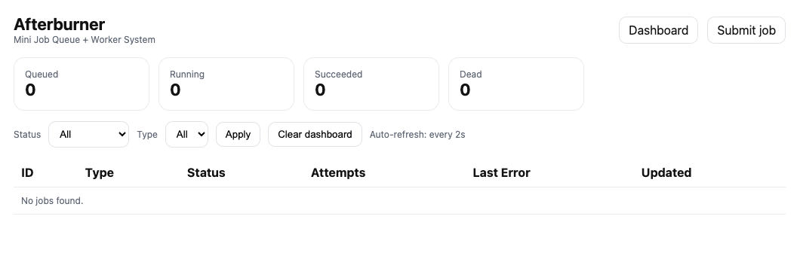
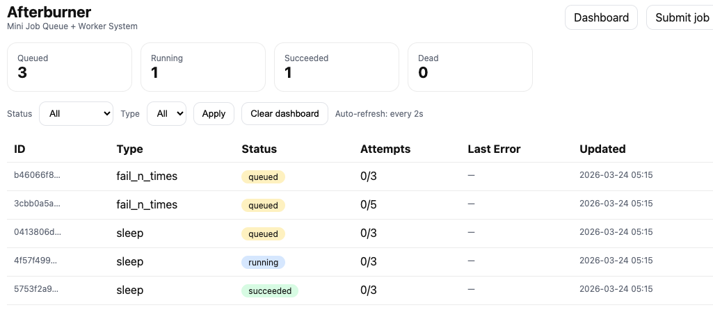
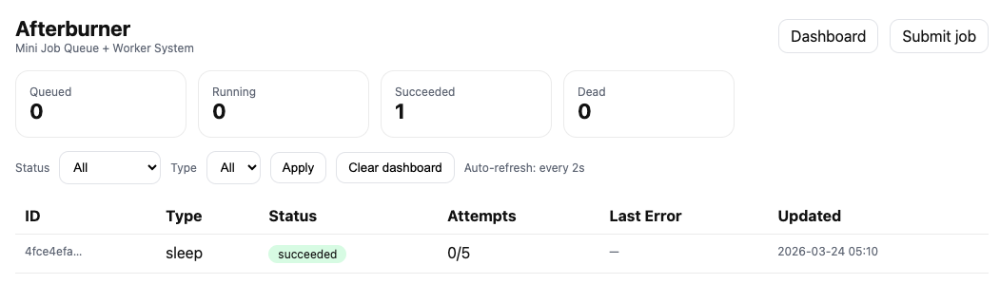
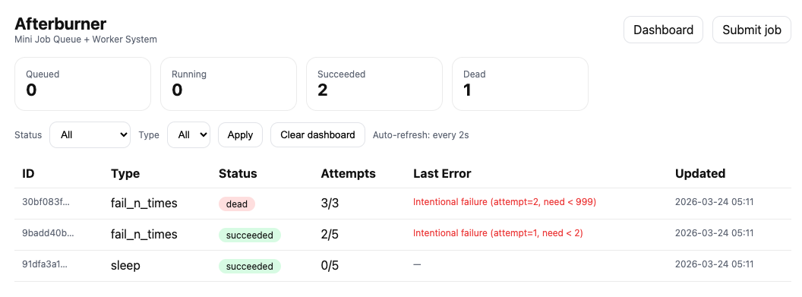
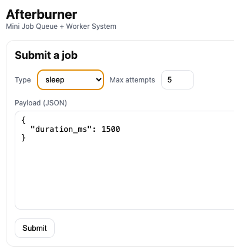

# Afterburner

A background job queue and worker system built on PostgreSQL and FastAPI.

Jobs are rows in a Postgres table. A Python worker polls that table, atomically claims runnable jobs using `SELECT FOR UPDATE SKIP LOCKED`, executes them, and writes outcomes back. The FastAPI server accepts job submissions and serves a live dashboard.

The goal is to show how production job queues work — durable storage, atomic claiming, retries with exponential backoff, dead-letter handling, and operational visibility — without a message broker or external queue service.

---
## Dashboard 

## Quick Start

```bash
docker compose up --build
```

Open the dashboard: **http://localhost:8000/**

That's it. Docker Compose starts Postgres, runs migrations, starts the API, and starts the worker. All three services are ready once you see:

```
afterburner-api     | INFO:     Application startup complete.
afterburner-worker  | [worker] starting id=worker-docker-1
```

---

## Architecture

```
Client (curl / browser)
        │
        │  POST /api/jobs
        ▼
┌──────────────────┐       INSERT
│   FastAPI API    │ ──────────────▶  ┌──────────────────┐
│   app/main.py    │                  │   PostgreSQL     │
└──────────────────┘                  │   jobs table     │
                                      └────────┬─────────┘
                                               │
                                SELECT FOR UPDATE SKIP LOCKED
                                               │
                                               ▼
                                      ┌──────────────────┐
                                      │  Worker Process  │
                                      │  app/worker.py   │
                                      └──────────────────┘
```

**Components:**

- **API** (`app/main.py`) — accepts job submissions, exposes job status, serves the dashboard
- **Worker** (`app/worker.py`) — polls Postgres, claims and executes jobs, writes results
- **Queue** (`app/queue.py`) — `enqueue_job`, `claim_job`, `mark_succeeded`, `mark_failed`
- **Database** — single `jobs` table; Postgres is the queue, the lock manager, and the store

---

## Job Lifecycle

```
enqueue_job()
      │
      ▼
   queued  ──── claim_job() ────▶  running
                                      │
               ┌──────────────────────┤
               │                      │                      │
           success              error + retries left    error + exhausted
               │                      │                      │
               ▼                      ▼                      ▼
          succeeded              queued (run_at        dead
                                 = now + backoff)
```

**States:**

| Status | Meaning |
|---|---|
| `queued` | Waiting to be claimed; eligible once `run_at <= now()` |
| `running` | Held by a worker under a 30s lease (`locked_until`) |
| `succeeded` | Completed; `result` JSON is populated |
| `dead` | Exhausted all attempts; `last_error` holds the final failure |


---

## Atomic Job Claiming

The worker claims jobs with a single SQL statement:

```sql
SELECT id
FROM jobs
WHERE status = 'queued'
  AND run_at <= now()
  AND (locked_until IS NULL OR locked_until < now())
ORDER BY created_at ASC
FOR UPDATE SKIP LOCKED
LIMIT 1;
```

- `FOR UPDATE` locks the selected row
- `SKIP LOCKED` means concurrent workers each get a *different* row — no blocking, no double-processing
- Immediately after the SELECT, the worker writes `status=running` and `locked_until = now() + 30s`
- If the worker crashes before finishing, the lease expires and any worker can reclaim the job

This is the at-least-once guarantee: every job runs at least once. Handlers should be idempotent because a crash-and-rerun is possible.

See [`app/queue.py`](app/queue.py) → `claim_job()`.


---

## Retries with Exponential Backoff

When a job fails, `mark_failed()` in [`app/queue.py`](app/queue.py):

1. Increments `attempts`
2. If `attempts >= max_attempts` → sets `status = dead`
3. Otherwise → sets `status = queued` with `run_at = now() + 2^attempts seconds`

Backoff schedule (capped at 300s):

| After attempt | Wait before retry |
|---|---|
| 1 | 2 s |
| 2 | 4 s |
| 3 | 8 s |
| 4 | 16 s |
| 5 | 32 s |
| 6+ | 64, 128, 256, 300 s |

---

## Dead-Letter Handling

Once `attempts >= max_attempts`, the job moves to `status = dead` and stays there. Dead jobs are visible in the dashboard (red pill), retain their `last_error`, and are never automatically retried.

To demonstrate dead-lettering:

```bash
curl -X POST http://localhost:8000/api/jobs \
  -H "Content-Type: application/json" \
  -d '{"type":"fail_n_times","payload":{"failures_before_success":999},"max_attempts":3}'
```

The job will attempt 3 times and then go dead.


---

## Demo Job Types

### `sleep`

Simulates a long-running task.

```json
{ "duration_ms": 1500 }
```

### `fail_n_times`

Fails intentionally `N` times, then succeeds. Useful for demonstrating retries and dead-lettering.

```json
{ "failures_before_success": 2 }
```

With `max_attempts = 5`, this job will fail twice, retry with backoff, then succeed on the third attempt.

---

## Dashboard

**http://localhost:8000/**

- Live counts: queued / running / succeeded / dead (auto-refreshes every 2s)
- Job table with status pills, attempt counts, and last error (auto-refreshes every 2s)
- Filterable by status and job type
- Job detail view showing payload, result, error, and lease state (live-polls every 2s)

**Submit jobs:** http://localhost:8000/submit



**Routes:**

| Route | Description |
|---|---|
| `GET /` | Dashboard |
| `GET /submit` | Job submission form |
| `GET /jobs/{id}` | Job detail view |
| `POST /api/jobs` | Create a job |
| `GET /api/jobs` | List jobs |
| `GET /api/jobs/{id}` | Get a job |

---

## API

```bash
# Submit a job
curl -X POST http://localhost:8000/api/jobs \
  -H "Content-Type: application/json" \
  -d '{"type":"sleep","payload":{"duration_ms":1000},"max_attempts":5}'

# List jobs
curl http://localhost:8000/api/jobs

# Get a specific job
curl http://localhost:8000/api/jobs/<JOB_ID>
```

---

## Failure Simulation

Validate retry, backoff, and dead-letter behavior across 110 jobs:

```bash
# Install requests if you don't have it
pip install requests

# Run with the stack already up
python scripts/simulate_failures.py
```

Scenarios:
- 30 jobs that succeed immediately
- 20 jobs that succeed after 1 retry
- 30 jobs that succeed after 2 retries
- 30 jobs that exhaust attempts and go dead

Expected output:

```
[PASS]  immediate success (sleep)
[PASS]  success after 1 retry
[PASS]  success after 2 retries
[PASS]  dead-lettered

ALL SCENARIOS PASSED
```

---

## Local Development (Without Docker)

You need a running Postgres instance. The quickest way:

```bash
# Start just Postgres via Docker
docker compose up db -d

# Copy and configure env
cp .env.example .env

# Install dependencies
pip install -r requirements.txt

# Run migrations
alembic upgrade head

# Start the API (in one terminal)
uvicorn app.main:app --reload

# Start the worker (in another terminal)
python -m app.worker
```

---

## Deployment

This project uses two long-running processes (API + worker), so it is **not suitable for Vercel** (serverless functions time out and cannot run a polling loop).

**Recommended: [Render.com](https://render.com)**

Render supports web services, background workers, and managed Postgres on the free tier. A [`render.yaml`](render.yaml) is included for one-command deployment:

1. Push the repo to GitHub
2. Connect the repo to Render
3. Render will detect `render.yaml` and provision all three resources (API, worker, Postgres) automatically
4. Set `DATABASE_URL` on both services to the Render Postgres internal connection string

**Other options:** Railway, Fly.io, or any VPS with Docker Compose.

---

## Scaling

Multiple workers can run concurrently with zero configuration changes:

```bash
docker compose up --scale worker=3
```

Postgres row locking ensures each job is claimed by exactly one worker. No coordination protocol needed.

---

## Tech Stack

- Python 3.12
- FastAPI + Uvicorn
- SQLAlchemy 2.0 (Core + ORM)
- PostgreSQL 16
- Alembic
- HTMX 1.9
- Docker / Docker Compose

---

## Docs

- [`docs/architecture.md`](docs/architecture.md) — detailed architecture, table schema, lifecycle diagrams
- [`docs/resume-alignment.md`](docs/resume-alignment.md) — maps every resume bullet to code proof, demo proof, and interview explanation
- [`docs/demo-script.md`](docs/demo-script.md) — step-by-step live demo and interview walkthrough

---

## Possible Extensions

- Priority queues (add a `priority` column, change ORDER BY)
- Named queues (add a `queue` column, workers subscribe to queues)
- Job cancellation (add `status = cancelled`, skip in worker)
- Scheduled / cron jobs (enqueue with future `run_at`)
- WebSocket-based live updates instead of HTMX polling
- Metrics endpoint (job throughput, failure rate, p99 latency)

---

## License

MIT
